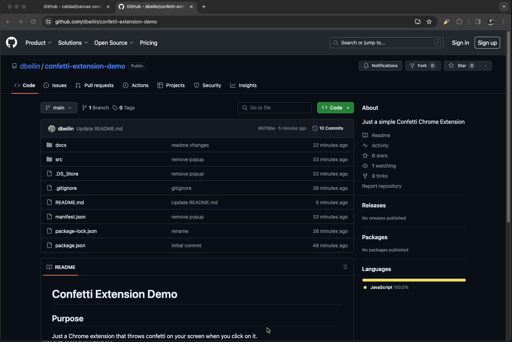

# Confetti Extension Demo

## Purpose
Just a Chrome extension that throws confetti on your screen when you click on it.
This project is just for educational purpose :)

### Automatically Upload To Chrome Store
Check out the [workflow](https://github.com/dbeilin/confetti-extension-demo/blob/main/.github/workflows/upload-to-store.yaml) that handles the process of zipping and uploading the extension to the Chrome web store.
The workflow is using [chrome-webstore-upload-cli](https://github.com/fregante/chrome-webstore-upload-cli) to upload the extension. It's worth checking out [this](https://github.com/fregante/chrome-webstore-upload-keys) guide to generate the necessary keys and tokens for the workflow.

## Result

## How to run
1. Clone repo.
2. `cd` into repo and run `npm install --save canvas-confetti`
3. Load extension in Developer Mode

## Credits
- [Confetti Icon](https://www.flaticon.com/free-icons/confetti)
- [Confetti Libarary](https://github.com/catdad/canvas-confetti)

## More information
* [Privacy Policy](docs/privacy.md)
